# 🚀 Project 9 — ECS Fargate CI/CD with High Availability

A production-style CI/CD pipeline that automatically builds, pushes, and deploys a Dockerized Flask app to **AWS ECS Fargate** across **2 Availability Zones** with an **Application Load Balancer** for High Availability.

Every `git push` triggers the full pipeline — zero manual steps.

---

## 🏗️ Architecture

```
Developer (git push)
        │
        ▼
┌─────────────────────┐
│    GitHub Actions   │
│  Build → Push → Deploy  │
└─────────────────────┘
        │
        ▼
┌─────────────────────┐
│     Docker Hub      │
│  ecs-ha-app:v1.0.N  │
└─────────────────────┘
        │
        ▼
┌──────────────────────────────────────────┐
│              AWS ap-south-1              │
│  ┌────────────────────────────────────┐  │
│  │         DEV VPC (10.0.0.0/16)      │  │
│  │   ┌──────────────────────────┐     │  │
│  │   │  Application Load Balancer│    │  │
│  │   │    HTTP:80  Round Robin   │    │  │
│  │   └────────┬─────────────────┘    │  │
│  │            │ 50%       50%         │  │
│  │     ┌──────┴──────┐               │  │
│  │     ▼             ▼               │  │
│  │ ┌────────┐   ┌────────┐           │  │
│  │ │ Task 1 │   │ Task 2 │           │  │
│  │ │  1a    │   │  1b    │           │  │
│  │ │10.0.1.x│   │10.0.3.x│           │  │
│  │ └────────┘   └────────┘           │  │
│  └────────────────────────────────── ┘  │
└──────────────────────────────────────────┘
```

---

## 📁 Project Structure

```
ecs-cicd-ha-project-9/
├── app.py
├── Dockerfile
├── terraform/
│   ├── main.tf
│   ├── variables.tf
│   └── outputs.tf
└── .github/
    └── workflows/
        └── ci-cd.yml
```

---

## ☁️ AWS Resources

| Resource | Name | Purpose |
|---|---|---|
| VPC | DEV_VPC | Isolated network |
| Public Subnets | Public-1a, Public-1b | Multi-AZ placement |
| Internet Gateway | dev-igw | Internet access |
| Route Table | public-rt | Route to IGW |
| Security Group | alb-sg | ALB HTTP :80 |
| Security Group | EC2-SG | ECS port :5000 from ALB |
| ALB | ecs-ha-alb | 50/50 round robin |
| Target Group | ecs-ha-tg | Health check + routing |
| ECS Cluster | Fargate | Container hosting |
| ECS Task Definition | ECS-HA-TASK | Container config |
| ECS Service | 2 tasks across AZs | HA deployment |
| CloudWatch Logs | /ecs/ECS-HA-TASK | Container logs |

---

## 🛠️ Tech Stack

| Tool | Purpose |
|---|---|
| Python Flask | Web application |
| Docker | Containerization |
| Docker Hub | Image registry |
| GitHub Actions | CI/CD pipeline |
| Terraform | Network infrastructure |
| AWS ECS Fargate | Serverless containers |
| AWS ALB | Load balancing |

---

## 🚀 Step-by-Step with Screenshots

---

### Step 1 — GitHub Repository Setup

Code is pushed to GitHub which triggers the GitHub Actions workflow automatically.

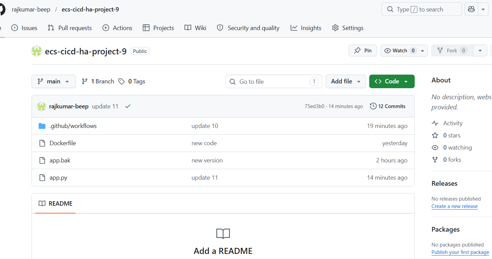

**Project contains:**
- `app.py` — Flask app showing ECS node info
- `Dockerfile` — Container definition with health check
- `terraform/` — Network infrastructure as code
- `.github/workflows/ci-cd.yml` — Full CI/CD pipeline

---

### Step 2 — Docker Hub Image Registry

On every `git push`, GitHub Actions builds and pushes a versioned image to Docker Hub.

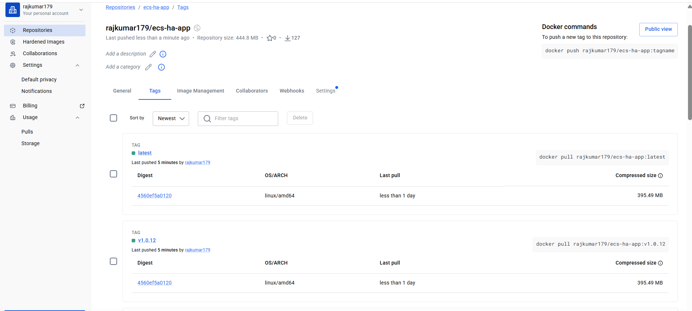

**Image tagging strategy:**
- `v1.0.1`, `v1.0.2`, `v1.0.3`... — versioned by `github.run_number`
- `latest` — always points to most recent build

---

### Step 3 — GitHub Actions CI/CD Pipeline

The pipeline runs automatically on every push to `main` branch.

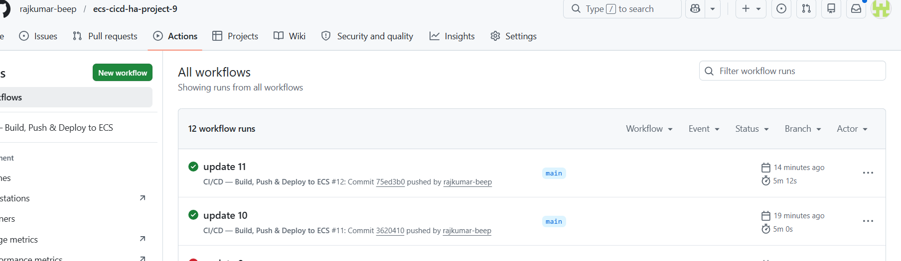

**Pipeline stages:**
1. Checkout code
2. Set version tag (`v1.0.$run_number`)
3. Login to Docker Hub
4. Build Docker image
5. Push to Docker Hub
6. Configure AWS credentials
7. Update ECS Task Definition (new revision auto-created)
8. Deploy to ECS Service (rolling update, waits for stability)

---

### Step 4 — Network Infrastructure (Terraform)

VPC, Subnets, Internet Gateway and Route Tables created with Terraform.

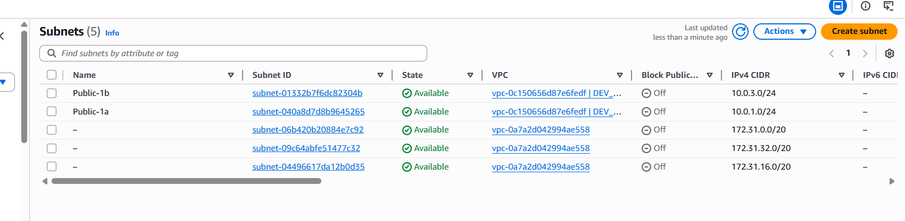

**Terraform manages:**
- VPC: `10.0.0.0/16`
- Public-1a: `10.0.1.0/24` (ap-south-1a)
- Public-1b: `10.0.3.0/24` (ap-south-1b)
- IGW attached to VPC
- Route Table: `0.0.0.0/0 → IGW`

```bash
cd terraform/
terraform init
terraform apply
```

---

### Step 5 — Application Load Balancer

ALB distributes traffic evenly across both ECS tasks using Round Robin.

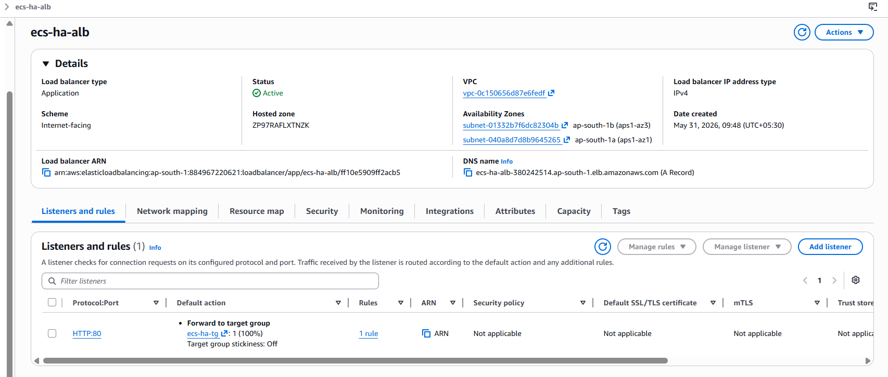

**ALB configuration:**
- Scheme: Internet-facing
- Listener: HTTP :80
- Algorithm: Round Robin (Stickiness disabled)
- Health check path: `/health`

---

### Step 6 — ECS Target Group

Target Group registers ECS tasks by IP address (required for Fargate).

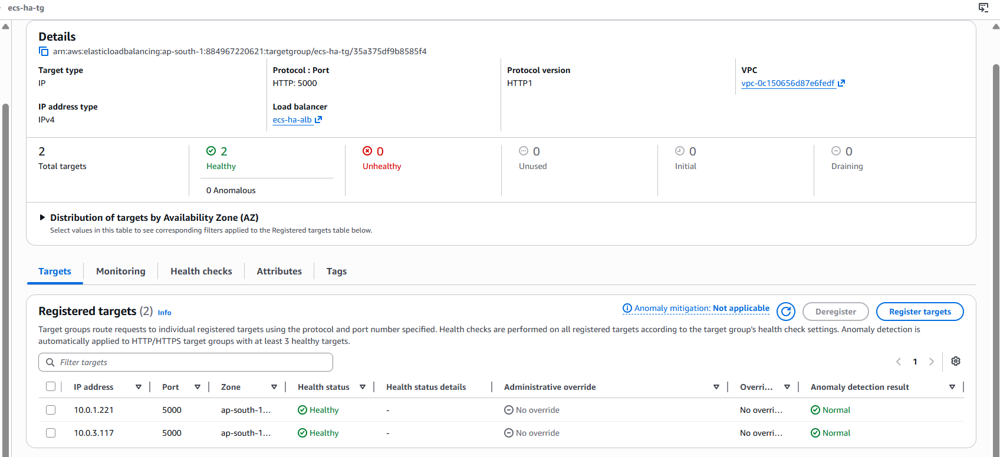

**Key setting — Target type: IP**
Fargate tasks get dynamic IPs on every restart. IP-based target group tracks them automatically.

---

### Step 7 — ECS Cluster

Fargate cluster hosts all containers without managing any servers.

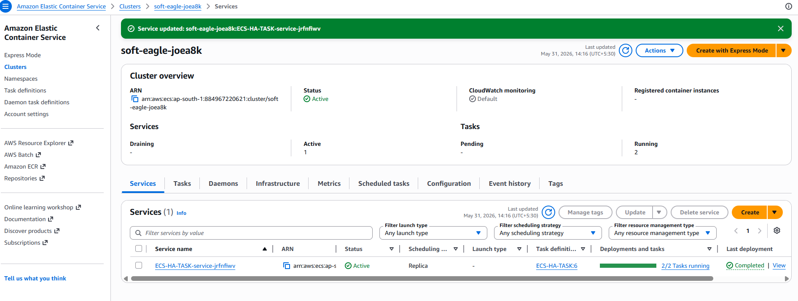

---

### Step 8 — ECS Task Definition

Defines the container configuration, resources, environment, and logging.

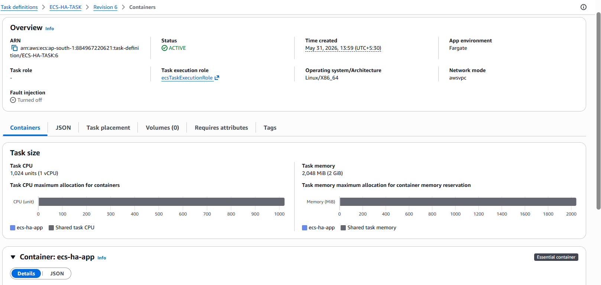

**Key settings:**
- Launch type: Fargate
- CPU: 0.25 vCPU / Memory: 0.5 GB
- Port: 5000
- Network mode: awsvpc (each task gets its own ENI + private IP)
- CloudWatch logging: enabled
- Health check: `/health` endpoint

---

### Step 9 — ECS Service

Service runs 2 desired tasks, one in each Availability Zone.

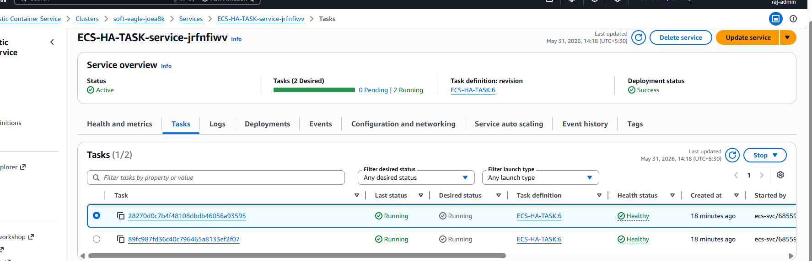

**Key settings:**
- Desired count: 2
- Subnets: both ap-south-1a and ap-south-1b
- Rolling update deployment
- Circuit breaker + auto rollback on failure
- Attached to ALB

---

### Step 10 — ✅ High Availability Proof

Refreshing the ALB URL alternates between both containers in different AZs — proving 50/50 round robin is working.

**Container 1 — ap-south-1a:**

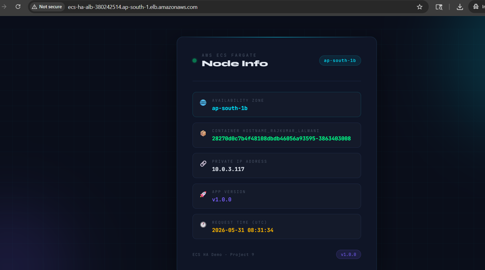

**Container 2 — ap-south-1b:**

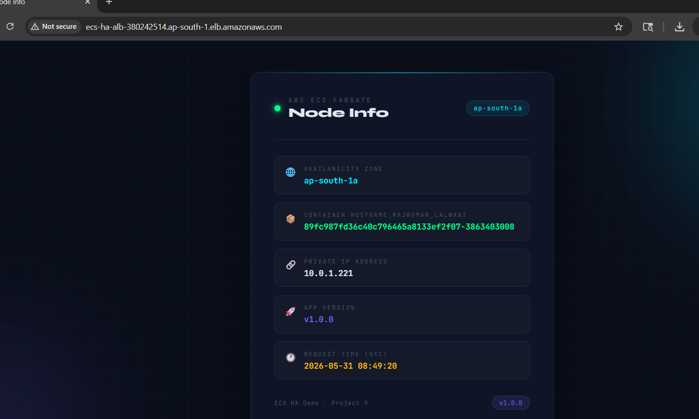

Each response shows:
- Different **Availability Zone** (1a vs 1b)
- Different **Private IP** (10.0.1.x vs 10.0.3.x)
- Different **Container Hostname**
- Same **App Version** (confirms same deployment)

---

## 🔀 High Availability Scenarios

### Scenario 1 — Normal Operation (50/50)

```
Request 1 → ap-south-1a → 10.0.1.x
Request 2 → ap-south-1b → 10.0.3.x
Request 3 → ap-south-1a → 10.0.1.x  (repeats)
```

### Scenario 2 — Task Failure & Auto Recovery

```
Task in 1a dies
    ↓
ALB health check fails → stops routing to dead task
    ↓
ECS detects failure → starts replacement task in 1a
    ↓
New task passes health check
    ↓
ALB resumes routing → back to 50/50
```
**Zero downtime throughout** ✅

---

## 🧹 Cleanup

```bash
# 1. ECS Service → Update → Desired count = 0
# 2. Delete ECS Service
# 3. Delete ALB + Target Group
# 4. Delete Security Groups
# 5. Terraform destroy
cd terraform/
terraform destroy
```

---

## 👤 Author

**Rajkumar**
DevOps Engineer
